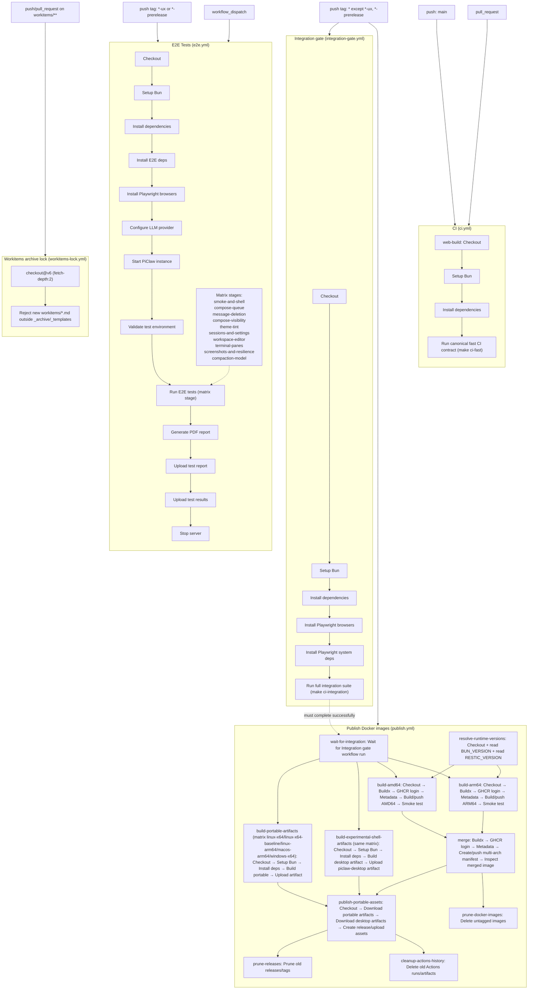

# CI workflows and dependencies

This page maps the GitHub Actions CI and release flow defined in `.github/workflows/`.

## Workflow files

- `.github/workflows/ci.yml`
- `.github/workflows/e2e.yml`
- `.github/workflows/integration-gate.yml`
- `.github/workflows/publish.yml`
- `.github/workflows/workitems-lock.yml`
