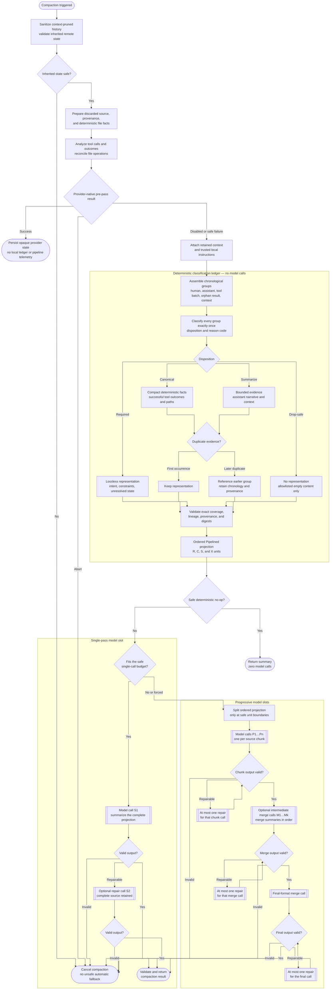
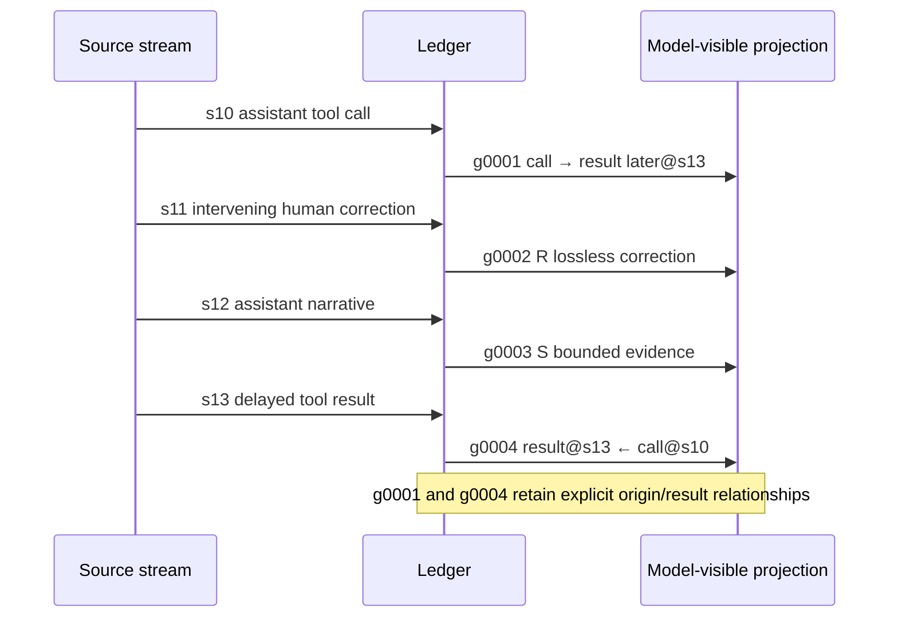

# Pipelined smart compaction

Pipelined is Piclaw's exact-once source-accounting smart-compaction method. It deterministically classifies every discarded source-message event into a provenance-bearing ledger before asking a model to rewrite the validated projection into the continuity summary. Auxiliary compaction inputs—such as the previous summary, retained context, trusted operator instructions, and deterministic file facts—are carried separately outside the source-event ledger.

Its central design rule is:

> Classification, retention policy, lineage, and coverage are deterministic. The model rewrites the validated projection; it does not decide which source events may disappear.

Pipelined is a local processing method inside the existing smart-compaction lifecycle, not a separate trigger or provider. When the local path runs, it shares model/auth resolution, output validation, progressive execution, retained-boundary checks, and post-compaction pruning with Selective. The optional provider-native remote-compaction pre-pass is orthogonal: a successful remote attempt returns an opaque provider state before the Pipelined ledger is built; a safe remote failure continues into the already selected local method.

## At a glance

| Property | Pipelined behavior |
|---|---|
| Canonical method name | `pipelined` |
| Default method | No. The default is `selective` |
| Selection lifetime | Captured once at the start of each compaction generation |
| Provider-native pre-pass | If enabled, a successful remote attempt completes before Pipelined; safe remote failure falls through to Pipelined |
| Classification model calls | None |
| Source accounting | Every discarded source event is classified exactly once |
| Required evidence | Lossless |
| Successful tool evidence | Deterministic compact facts |
| Narrative/context evidence | Bounded evidence |
| Safe drops | Allowlisted empty content only |
| Duplicate handling | Provenance-bearing reference; chronology is retained |
| Execution | Deterministic no-op, single pass, or progressive |
| Automatic fallback to Selective | None |
| Automatic fallback to upstream full-pass compaction | None |
| Result | Validated `CompactionResult` with summary, retained boundary, and pre-compaction token count |

## Guarantees and non-goals

### Behavioral guarantees

Pipelined is designed to preserve these invariants:

- The complete discarded stream is represented in source order.
- Every source event belongs to exactly one ledger record.
- Human intent, corrections, constraints, and questions remain lossless.
- Orphan tool results and unresolved tool states remain lossless.
- Delayed tool results remain at their observed chronological position.
- Successful tool activity may be reduced to deterministic facts without losing call/result lineage.
- Compatible exact-duplicate non-required groups may become references, but they are not silently dropped.
- Opaque entry IDs remain machine provenance and are not injected into model-visible history.
- Provider input overflow never causes an automatic retry with omitted source.
- Unsafe or unverifiable execution cancels instead of falling through to a less constrained compaction path.

### Non-goals

Pipelined does not promise:

- A fixed compression percentage. Compression depends on the source mix.
- Fixed chunk sizes, merge counts, or progressive concurrency.
- Semantic importance classification by a model.
- Meaningful replay/provider tool-call IDs in the summary.
- That every successful tool output will be reproduced verbatim; canonical records preserve bounded deterministic facts.
- That internal group IDs or classification heuristics are a public TypeScript API.

## End-to-end flow

The full generation sanitizes context-pruned history and validates inherited remote state before shared source preparation and the optional provider-native pre-pass. Only a skipped or safely failed pre-pass enters the captured local Pipelined ledger path, where retained context and trusted instructions are attached.



## 1. Capture one compaction generation

The `session_before_compact` handler in `runtime/src/extensions/smart-compaction/orchestrator.ts` begins the lifecycle.

At the start it captures the runtime configuration once. An in-flight compaction therefore cannot switch from Pipelined to Selective, adopt a new timeout, or otherwise change policy midway through the generation. Changes made through the web settings/runtime API affect the next compaction without a restart; manual configuration-file or environment changes require a restart unless the running process is updated separately.

Compaction planning combines:

- discarded source events: `preparation.messagesToSummarize`, plus the split-turn prefix when `preparation.isSplitTurn` is true
- auxiliary inputs outside the exact-once source-event ledger: the previous summary, retained-context summary, trusted operator compaction instructions, and deterministic file facts
- provenance metadata: source entry IDs resolved from the branch for retained-boundary and provenance checks

Context-pruned history is sanitized first, and malformed or model-incompatible inherited remote state is rejected before any new remote attempt. Source preparation, tool-outcome analysis, and file-operation reconciliation then occur before the optional remote attempt. If that attempt is skipped or fails safely, the local path attaches retained-context guidance and trusted compaction instructions before building the Pipelined ledger. If context pruning already retained a canonical summary for a tool call, Pipelined records a provenance-bearing reference instead of reintroducing the omitted raw result.

### Provider-native pre-pass

If provider-native compaction is enabled, the orchestrator attempts that capability after the shared preparation steps and before `smart_compaction.source_prepared`, local Pipelined classification, or local compaction model calls. A successful attempt persists the provider's opaque canonical state and completes the generation without building a Pipelined ledger or emitting `smart_compaction.pipeline_planned`. Disabled, unsupported, unauthenticated, timed-out, malformed-response, provider-failure, and backoff outcomes continue into the captured local Pipelined method without partially mutating the session. An abort cancels instead of falling through. Malformed or model-incompatible previously persisted remote state also fails closed rather than being rewritten locally.

## 2. Prepare provenance-bearing source events

`prepareCompactionSource()` builds a `PreparedCompactionSource`. Each source event receives:

| Field | Purpose |
|---|---|
| `sourceIndex` | Stable chronological position in the complete discarded stream |
| `sourceEntryId` | Optional machine provenance and retained-boundary identity |
| `rawMessage` | Original source message |
| `modelSafeMessages` | Provider-neutral projections derived from that source event |
| `modelSafeMessageIndexes` | Links into the provider-neutral message sequence |
| `classification` | Coarse source class |
| `contextPruned` | Whether context pruning replaced or omitted the raw provider projection |

The coarse source classes are:

| Source class | Meaning |
|---|---|
| `human` | A real human user turn |
| `synthetic` | A compaction/branch summary or another synthetic user-role wrapper |
| `assistant` | Assistant narrative or tool-call message |
| `tool` | Tool result |
| `context` | Other source-bearing context |

Synthetic user-role wrappers are detected before ordinary user turns so inherited summaries are not mistaken for new human intent.

## 3. Assemble chronological event groups

`assemblePipelineEvents()` turns the event stream into ordered logical groups:

| Group kind | Contents |
|---|---|
| `human_turn` | Real human intent, correction, constraint, or question |
| `assistant_narrative` | Assistant prose without a local tool batch |
| `tool_batch` | An assistant tool-call message and only its immediately adjacent result stream |
| `orphan_tool_result` | A result that cannot be reconciled to an originating call |
| `synthetic_context` | Synthetic continuity wrapper already present in the discarded source, such as a compaction or branch summary |
| `ungrouped_context` | Remaining source-bearing context, including delayed results at their observed position |

A source event is consumed by one group only. Grouping does not move delayed results backward across intervening human or assistant turns.

### Delayed tool-result chronology



A local `MISSING` marker means that the result was not adjacent to the call. It does not mean that a later reconciled result was lost. Relationships connect the origin and later-result groups while preserving both positions.

## 4. Classify each group

Classification is deterministic. It produces a disposition and reason code for every group.

### Dispositions and representations

| Disposition | Representation mode | Prompt code | Current use |
|---|---|---|---|
| `required` | `lossless` | `R` | Human turns, orphan results, unresolved tool state, delayed errors/no-change outcomes |
| `canonical` | `compact_facts` | `C` | Successful tool activity, delayed successful results, synthetic continuity, context-prune references |
| `summarize` | `bounded_evidence` | `S` | Assistant narrative and general context |
| duplicate-reference record | `reference` | `X` | Compatible exact-duplicate non-required group content with independent chronology |
| `drop_safe` | `none` | No emitted unit | Allowlisted empty content only |

`X` is a representation/header code, not a separate disposition. Duplicate-reference records retain their underlying `canonical` or `summarize` disposition.

`required` is a retention requirement, not a suggestion to the summarizing model. Its representation ends with the complete canonical rendering of the source group. Extra lineage text may be prefixed, but source content is not removed.

Canonical tool facts preserve the tool name, outcome state, source lineage, bounded outcome evidence, and identifying argument evidence. Exact paths are retained. Very long commands or queries may use bounded head/tail evidence plus a SHA-256 argument digest.

Bounded evidence preserves edges and selected high-signal snippets such as errors, constraints, decisions, paths, and regression/test references. The exact character budgets are implementation details and may change.

### Reason codes

| Reason code | Normal disposition | Meaning |
|---|---|---|
| `human_goal` | Required | Human request or goal |
| `human_correction` | Required | Human correction or superseding instruction |
| `human_constraint` | Required | Explicit constraint or prohibition |
| `human_question` | Required | Human question |
| `unresolved_tool_state` | Required | Error, no-change result, or globally missing result |
| `orphan_tool_result` | Required | Result without a reconciled call |
| `observed_tool_batch` | Canonical | Successful adjacent call/result activity |
| `observed_later_tool_state` | Canonical | Call whose result exists later rather than locally |
| `delayed_tool_result` | Canonical | Successful result observed later in the stream |
| `synthetic_continuity` | Canonical | Synthetic continuity wrapper already present in the discarded source |
| `context_prune_summary_reference` | Canonical | Raw result omitted because context pruning retained its canonical summary |
| `assistant_decision` | Summarize | Assistant narrative containing decision signals |
| `assistant_narrative` | Summarize | Other assistant narrative |
| `context` | Summarize | Other source-bearing context |
| `empty_content` | Drop-safe | Empty content; currently the only allowlisted drop reason |

These codes describe current policy semantics. The exact text heuristics that choose among human or assistant reason codes are implementation details.

## 5. Record tool state and lineage

Tool outcome analysis runs once over the provider-neutral messages. Each ledger tool fact records:

- tool name and call ordinal
- identifying argument evidence and argument digest
- originating assistant source index
- result source index and optional result entry ID
- observation mode: `adjacent`, `later`, or `none`
- outcome status: `success`, `error`, `no_change`, or `missing`
- significance and low-information-success flags
- outcome evidence used to build the model-visible representation

Relationships are recorded in both directions:

- `laterResultGroupIds` on an originating tool group
- `originToolGroupIds` on a delayed-result group

Groups carrying tool facts or delayed-result relationships are not eligible for duplicate-reference reduction. This prevents visually similar outcomes from merging distinct execution lineage.

## 6. Reduce exact duplicates without losing events

Duplicate handling happens after classification and representation planning.

A later group is reference-eligible only when it:

- is neither `required` nor `drop_safe`
- has a semantic digest
- has no tool facts
- has no origin/later-result relationship
- matches the first group's disposition, reason code, and semantic digest

This is exact-duplicate reduction under the current digest-and-classification policy, not a general semantic-equivalence pass.

The first occurrence keeps its representation. A later occurrence receives its own audit record and source provenance, but its body becomes a compact reference such as:

```text
### g0007 [X s=19]
= g0002 (duplicate evidence; chronology retained)
```

Required records are never converted into references.

## 7. Validate the ledger before model execution

`validatePipelineCoverage()` rejects a plan unless all invariants hold.

### Coverage and representation invariants

- Every source index is classified exactly once.
- Every group has exactly one audit record.
- Every non-dropped record has exactly one representation.
- Every dropped record has no representation.
- Every drop uses an allowlisted reason.
- Every required record uses `lossless` mode.
- Every lossless representation contains the complete canonical group rendering.
- Every representation ID is unique and referenced exactly once.

### Provenance and relationship invariants

- Unit group IDs match their audit records.
- Unit source indexes and source entry IDs match their records exactly and in order.
- Duplicate references target an existing compatible non-required record.
- Origin and later-result relationship IDs refer to existing groups.
- Tool-call and result source indexes refer to known source events.
- Opaque entry IDs remain metadata rather than model-visible semantic text.

### Integrity and metric invariants

Each record contains:

- source, semantic, and representation SHA-256 digests
- source and represented character counts
- character reduction percentage
- character-derived source and represented token estimates
- token reduction percentage

Aggregate compression metrics are recomputed from the records and must match the stored totals. Metrics are also broken down by disposition and include the duplicate-reference count.

The ledger token figures are planning estimates derived from character counts; they are not provider billing measurements.

## 8. Build the model-visible projection

A non-dropped representation becomes a `CompactionSourceUnit` with:

- a representation ID and group ID
- rendered text
- source indexes and source entry IDs
- reserved `segmentIndex`/`segmentCount` metadata, currently emitted as `1/1`; progressive segmentation is expressed later when chunks are built

Prompt-visible headers are compact:

```text
### g0001 [R s=0-2]
### g0002 [C s=3]
### g0003 [S s=4-5]
### g0004 [X s=6]
```

Here `s=` identifies source-event provenance. Replay IDs are explicitly declared non-semantic.

### Prompt trust boundary

The single-pass Pipelined prompt separates content into labelled sections:

- `<previous_summary_source_data>`
- `<trusted_operator_compaction_instructions>`
- `<retained_context_source_data>`
- `<deterministic_file_facts_source_data>`
- `<ordered_pipeline_groups_source_data>`

Only operator compaction instructions occupy the trusted-instruction section. History, inherited summaries, retained context, file facts, and ledger units are source data rather than instructions.

Source-data delimiter characters (`&`, `<`, and `>`) are escaped before insertion. This prevents history or tool output from closing a section and injecting structural prompt instructions.

When a compatible provider-native state already exists and a new remote attempt falls back locally, its opaque canonical window is prepended at the provider-payload boundary rather than decoded into the text prompt or classified by the ledger. The ledger accounts for the new discarded source-message events; inherited remote file facts are merged into the separate deterministic file-facts input.

## 9. Slot model calls after the ledger

Ledger construction, classification, canonicalization, duplicate handling, integrity validation, and prompt construction make no model calls.

After planning, the orchestrator chooses one execution shape without changing the selected method.

### Deterministic no-op: zero calls

A safe no-op may reuse or mechanically produce a valid summary. It is accepted only when:

- the source shape is eligible
- the final summary schema validates
- the retained boundary is valid
- the estimated post-compaction context fits

Source-bearing non-tool continuity context disables the no-op path. If no-op validation or fit fails, execution continues to model-based compaction.

### Single pass: one call, optionally two

If the complete prompt fits the safe model budget:

1. One model call receives the complete Pipelined projection.
2. The response must stop normally and pass final-schema validation.
3. A retryable invalid response may receive one repair call.
4. The repair call retains the complete source prompt and adds a format-repair instruction.

A provider input-overflow response is not repaired by trimming source.

### Progressive: chunk and merge calls

When the complete request does not fit—or progressive execution is forced—the validated Pipelined units become the progressive source:

1. Units are packed into ordered chunks; oversized units may be segmented while retaining provenance. When a previous summary exists, progressive execution first converts it into its own atomic continuity source chunk instead of leaving it only to the final merge prompt.
2. Chunk model calls produce validated intermediate checkpoints.
3. Intermediate summaries are merged in order, potentially through multiple passes.
4. A final merge produces the normal final summary schema.
5. Each retryable invalid chunk or merge response may receive at most one repair attempt when the complete prompt plus repair instruction still fits.

Chunk calls can be concurrent, but results are retained and merged in source order. Exact concurrency and chunk budgets are implementation details.

Intermediate model-authored `<read-files>` and `<modified-files>` blocks are auxiliary rather than authoritative. Before chunk or final schema validation, Piclaw strips any number of complete, non-nested blocks only when they form one contiguous trailing group after the terminal section. Malformed, unbalanced, nested, misplaced, empty, interleaved, or non-trailing blocks are still rejected. This normalization cannot add or change file facts: after final validation, Piclaw appends one canonical pair derived from deterministic tool-operation analysis.

If a provider has a hidden input cap, progressive execution bisects the complete ordered batch instead of silently truncating it.

## 10. Handle time budgets and retained boundaries

Progressive execution may exhaust its time budget after completing only an atomic prefix of chunks.

When that happens, Pipelined may return a partial progressive summary only if it can:

1. identify the exact first unsummarized source event
2. map it to a valid branch entry and compaction cut point
3. move `firstKeptEntryId` to that entry
4. keep every unsummarized message verbatim
5. verify that the resulting summary plus retained tail still fits the context window

If any check fails, compaction cancels.

If every chunk has already been summarized but a later merge cannot finish within the time budget, the runtime may construct a deterministic final-format summary from the complete ordered chunk summaries. That is a complete-coverage fallback, not a partial source drop.

## 11. Validate the final summary

Pipelined uses the shared strict final-summary schema. A valid response must:

- finish with provider `stopReason=stop`
- stay within configured minimum and maximum size bounds
- contain each required top-level heading exactly once and in order
- contain no extra top-level headings or leading commentary
- provide substantive `Goal`, `Progress`, and `Critical Context` sections
- structure `Progress` as `Done`, `In Progress`, and `Blocked`
- contain no malformed, unbalanced, nested, misplaced, empty, interleaved, or non-trailing model-authored file blocks

Required final headings:

1. `Goal`
2. `Current Active Topic`
3. `Historical / Background Context`
4. `Constraints & Preferences`
5. `Progress`
6. `Key Decisions`
7. `Next Steps`
8. `Critical Context`

Invalid partial output is not persisted. Retryable validation failures get at most one repair attempt per model invocation; otherwise compaction cancels.

Complete model-authored file blocks are stripped before schema validation, including repeated blocks, because they are not authoritative. After validation, Piclaw appends exactly one `<read-files>` and/or `<modified-files>` block from reconciled deterministic tool operations, then adjusts the retained window if needed to keep the resulting context within the target model budget.

## 12. Failure and fallback behavior

Pipelined deliberately fails closed.

| Condition | Behavior |
|---|---|
| Model or credentials unavailable | Cancel compaction |
| Abort signal | Return cancellation |
| Ledger invariant fails | Cancel through the lifecycle error path |
| Provider input overflow | If planning detects overflow risk, use safe progressive coverage. Single-pass overflow cancels without trimming source or switching methods. Progressive hidden-cap overflow bisects the complete chunk or merge input without dropping coverage; cancel if safe recovery cannot preserve complete input. |
| Invalid output | One eligible repair attempt, then cancel |
| Progressive execution error | Cancel; do not fall back to full-pass compaction |
| Unsafe partial retained boundary | Cancel |
| Post-compaction estimate does not fit | Adjust a valid retained boundary or cancel |

There is no automatic Pipelined-to-Selective fallback and no automatic fallback to upstream full-pass compaction. The no-op, single-pass, and progressive paths are execution shapes within the same selected Pipelined generation.

## 13. Configure Pipelined

### Web UI

Open **Settings → Compaction → Processing method** and select **Pipelined**.

The web setting is applied to the running process without a restart. An active compaction keeps the method captured at the start of its generation; the next generation sees the new setting.

### Environment

```bash
PICLAW_SMART_COMPACTION_METHOD=pipelined
```

### Configuration file

```json
{
  "compaction": {
    "smartCompactionMethod": "pipelined"
  }
}
```

The canonical values are `selective` and `pipelined`. The legacy values `traditional_pipelined`, `traditional-pipelined`, and `traditional pipelined` are accepted and normalized to `pipelined`. Unknown values fall back to the current/default method.

The default is `selective`. Environment values and manual `.piclaw/config.json` edits are startup inputs; restart the process for those external changes unless the runtime settings API is also used.

### Interaction with provider-native compaction

The separate `remoteCompactionEnabled` setting controls an opt-in provider-native pre-pass. It does not select or replace `smartCompactionMethod`: `pipelined` is the captured local method and is used when the remote path is disabled or cannot complete safely. A successful remote attempt returns before local ledger construction, so it does not emit Pipelined planning telemetry. On local fallback from a compatible inherited remote state, the opaque canonical window stays provider-level input outside the ledger; Pipelined classifies the new discarded source and carries inherited file facts separately. See [Provider-native remote compaction](configuration.md#provider-native-remote-compaction) for its capability matrix, persistence, replay, and configuration contract.

## 14. Observe and audit execution

### Planning telemetry

After the local Pipelined ledger validates, the structured debug operation `smart_compaction.pipeline_planned` includes:

- `method`
- `sourceEventCount`
- `groupCount`
- `sourceUnitCount`
- `dispositionCounts`
- `pipelineCompression`
- `coverageComplete`
- `auditLedger`

### Completion telemetry

The `smart_compaction.completed` operation includes fields appropriate to the execution path, including:

- selected `method` and optional execution shape
- source event/group counts and disposition counts
- source, canonical, semantic-input, summary, retained, and post-compaction token estimates
- deterministic and final reduction percentages
- `modelCallCount`
- total and processed chunk counts for progressive execution
- duration
- partial retained boundary, if any
- final coverage status

### Audit-ledger privacy boundary

Structured audit telemetry does not copy raw tool arguments, exact paths, or raw outcome text. Tool facts are reduced to fields such as:

- tool name and call ordinal
- argument digest and argument/path character counts
- assistant/result source indexes and result entry ID
- observation and outcome status
- significance flags
- outcome character count

The model-visible projection still contains the evidence required by the selected representation; the telemetry privacy reduction applies to structured logs.

### Useful operations

| Operation | Diagnostic purpose |
|---|---|
| `smart_compaction.source_prepared` | Complete source/event counts |
| `smart_compaction.pipeline_planned` | Ledger, coverage, compression, and audit records |
| `smart_compaction.completed` | End-to-end compression and model-call metrics |
| `smart_compaction.output_retry` | Single-pass repair attempt |
| `smart_compaction.output_invalid` | Rejected single-pass output |
| `smart_compaction.progressive_output_retry` | Progressive repair attempt |
| `smart_compaction.progressive_output_invalid` | Rejected progressive output |
| `smart_compaction.progressive_merge_hidden_cap_bisect` | Complete ordered merge batch bisected for a hidden provider cap |
| `smart_compaction.context_prune_sanitize` | Context-pruned history normalized before planning |
| `smart_compaction.boundary_selection` | Retained-boundary decision evidence |

The web UI also publishes `smart_compaction` status and `context_usage` updates during the lifecycle. Manual `/compact` publishes a fresh context update immediately after completion: Piclaw prefers the rebuilt-session estimate and falls back to the report's safety-adjusted estimate when rebuilt-session tokens are unavailable. Null-token updates are not persisted or broadcast. The context endpoint also falls back to validated persisted usage after session eviction or lookup failure, so the indicator does not require a new model turn to refresh. If provider-native compaction succeeds first, expect `remote_compaction.attempt` and `remote_compaction.completed` instead of `smart_compaction.pipeline_planned` and local Pipelined completion metrics.

## 15. Troubleshoot Pipelined compaction

### Pipelined is not selected or no ledger telemetry appears

Check, in order:

1. the web **Compaction → Processing method** value
2. `PICLAW_SMART_COMPACTION_METHOD`
3. `compaction.smartCompactionMethod` in `.piclaw/config.json`
4. whether provider-native compaction completed first (`remote_compaction.completed`)
5. `method` in `smart_compaction.source_prepared` or `smart_compaction.completed` when the local path ran

Remember that a settings change cannot alter an already-running generation. A successful provider-native pre-pass intentionally bypasses Pipelined ledger construction for that generation; disable the pre-pass when diagnosing the local ledger itself.

### A tool call says `MISSING`

Inspect the later ledger records and relationship metadata. The local group may use `observed_later_tool_state`, with a later `delayed_tool_result` record linked back to the call. Local missing means “not adjacent here”; globally missing state is treated as unresolved and required.

### Compaction cancels after provider overflow

This is expected when complete progressive coverage or a safe retained boundary cannot be maintained. Pipelined will not remove unseen source to force a request through a provider limit.

### Output is rejected

Inspect `smart_compaction.output_invalid` or `smart_compaction.progressive_output_invalid`, especially the validation code and stop reason. A repair is attempted only once and only when the complete repaired request fits safely. Repeated complete trailing `<read-files>` or `<modified-files>` blocks are normalized away and rebuilt canonically; `invalid_file_sections` now indicates a genuinely malformed, nested, misplaced, empty, interleaved, or non-trailing block shape.

### Coverage is false at completion

The deterministic ledger itself validates with complete source accounting. A completed progressive run can report final `coverageComplete: false` only when it intentionally summarized an atomic prefix and retained the exact unsummarized tail verbatim at `partialBoundary`.

### Raw tool output is absent

Check for `context_prune_summary_reference`. Context pruning may already have retained the canonical result summary, so Pipelined preserves provenance without reintroducing the omitted raw payload.

### Auto-compaction is suppressed after failures

Inspect compaction backoff state in the Compaction settings panel and reset the relevant chat backoff if appropriate. Also inspect the progress-watchdog table when watchdog supervision is enabled.

## 16. Stable contract versus implementation detail

Treat these as behavioral contracts:

- canonical method names and compatibility aliases
- generation-scoped local-method selection and provider-native pre-pass ordering
- exact-once source accounting when the local Pipelined path runs
- required/canonical/summarize/drop-safe semantics
- lossless required records
- delayed-result chronology and lineage
- provenance-bearing duplicate references
- no unsafe automatic fallback
- validated final-summary schema
- structured planning/completion telemetry operations

Treat these as implementation details:

- exact reason-detection regular expressions
- group numbering and prompt formatting beyond their local meaning
- bounded-evidence character limits
- character-to-token estimation ratio
- chunk sizes, concurrency, merge fan-in, and number of merge passes
- sample benchmark compression percentages
- exact UI status wording

## 17. Implementation and test map

### Core orchestration

- `runtime/src/extensions/smart-compaction.ts` — facade and compatibility exports
- `runtime/src/extensions/smart-compaction/orchestrator.ts` — lifecycle and execution selection
- `runtime/src/extensions/smart-compaction/model-request.ts` — model/auth resolution
- `runtime/src/extensions/smart-compaction/model-execution.ts` — single-pass call and repair
- `runtime/src/extensions/smart-compaction/remote-compaction.ts` — optional provider-native pre-pass, opaque persistence, compatibility checks, and replay
- `runtime/src/extensions/smart-compaction/progressive.ts` — progressive calls, merges, and partial completion
- `runtime/src/extensions/smart-compaction/summary-validation.ts` — final/chunk output validation and safe model-authored file-block normalization
- `runtime/src/extensions/smart-compaction/boundary-policy.ts` — retained-boundary safety

### Pipelined ledger

- `runtime/src/extensions/smart-compaction/source.ts` — provenance-bearing source events
- `runtime/src/extensions/smart-compaction/messages.ts` — provider-neutral conversion and tool-outcome analysis
- `runtime/src/extensions/smart-compaction/pipeline-events.ts` — chronological grouping
- `runtime/src/extensions/smart-compaction/pipeline-policy.ts` — classification, representations, audit records, and invariants
- `runtime/src/extensions/smart-compaction/pipelined.ts` — complete prompt and privacy-reduced audit telemetry
- `runtime/src/extensions/smart-compaction/progressive-policy.ts` — chunking and merge prompts
- `runtime/src/extensions/smart-compaction/noop.ts` — deterministic zero-call path

### Configuration and UI

- `runtime/src/core/config.ts`
- `runtime/src/channels/web/handlers/compaction-settings.ts`
- `runtime/web/src/components/settings/compaction.ts`
- `runtime/web/static/visual/frontend/src/panels/settings/CompactionSection.tsx`

### Focused tests

- `runtime/test/extensions/pipelined.test.ts` — policy, provenance, lineage, prompt, telemetry, and adversarial cases
- `runtime/test/extensions/pipelined-compression.test.ts` — representation and compression regressions
- `runtime/test/extensions/smart-compaction.test.ts` — lifecycle, progressive execution, boundaries, repairs, and fallback behavior
- `runtime/test/extensions/smart-compaction-context.test.ts` — status/context progress behavior
- `runtime/test/config/config.test.ts` — method normalization and precedence
- `runtime/test/web/compaction-settings-handler.test.ts` — runtime settings contract
- `runtime/test/web/compaction-settings-ui.test.ts` — UI setting behavior

## Related documentation

- [Configuration](configuration.md#smart-compaction-processing-method)
- [Settings and add-ons](settings-and-addons.md#compaction-order-13)
- [Architecture](architecture.md)
- [Runtime flows](runtime-flows.md)
- [Observability](observability.md)
